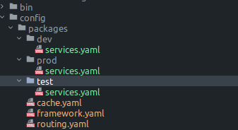
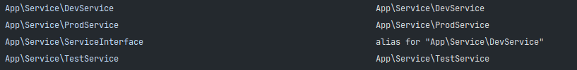
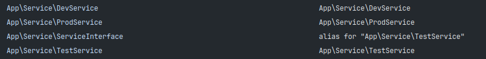

# Introduction

Every application can be configured per environment. For example:

- Dev
- Test
- Prod

# Configuration ways
## Attributes
```php
use Symfony\Component\DependencyInjection\Attribute\When;

// SomeClass is only registered in the "dev" environment

#[When(env: 'dev')]
class SomeClass
{
    // ...
}

// you can also apply more than one When attribute to the same class

#[When(env: 'dev')]
#[When(env: 'test')]
class AnotherClass
{
    // ...
}
```
_Snippet from Symfony documentation - [LINK](https://symfony.com/doc/current/service_container.html#limiting-services-to-a-specific-symfony-environment:~:text=You%20can%20use%20the%20%23%5BWhen%5D%20attribute%20to%20only%20register%20the%20class%20as%20a%20service%20in%20some%20environments)
_

## Yaml - when@env
```yaml
# config/packages/webpack_encore.yaml
webpack_encore:
    # ...
    output_path: '%kernel.project_dir%/public/build'
    strict_mode: true
    cache: false

# cache is enabled only in the "prod" environment
when@prod:
    webpack_encore:
        cache: true

# disable strict mode only in the "test" environment
when@test:
    webpack_encore:
        strict_mode: false

# YAML syntax allows to reuse contents using "anchors" (&some_name) and "aliases" (*some_name).
# In this example, 'test' configuration uses the exact same configuration as in 'prod'
when@prod: &webpack_prod
    webpack_encore:
        # ...
when@test: *webpack_prod
```
_Snippet from Symfony documentation - [LINK](https://symfony.com/doc/current/configuration.html#configuration-environments:~:text=You%20can%20also%20define%20options%20for%20different%20environments%20in%20a%20single%20configuration%20file%20using%20the%20special%20when%20keyword%3A)_

## Yaml - directories


### dev
```yaml
parameters:

services:
  _defaults:
    autowire: true
    autoconfigure: true

  App\:
    resource: '../../../src/'

  App\Service\DevService:
    public: true
  App\Service\ServiceInterface: '@App\Service\DevService'
```

``bin/console debug:container --env=dev``


### prod
```yaml
parameters:

services:
  _defaults:
    autowire: true
    autoconfigure: true

  App\:
    resource: '../../../src/'

  App\Service\ProdService:
    public: true
  App\Service\ServiceInterface: '@App\Service\ProdService'
```

``bin/console debug:container --env=prod``


### test
```yaml
parameters:

services:
  _defaults:
    autowire: true
    autoconfigure: true

  App\:
    resource: '../../../src/'

  App\Service\TestService:
    public: true
  App\Service\ServiceInterface: '@App\Service\TestService'
```

``bin/console debug:container --env=test``

